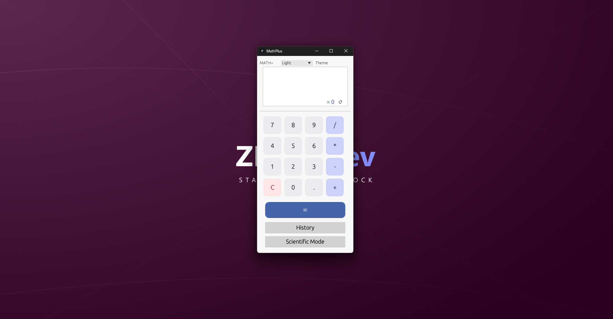
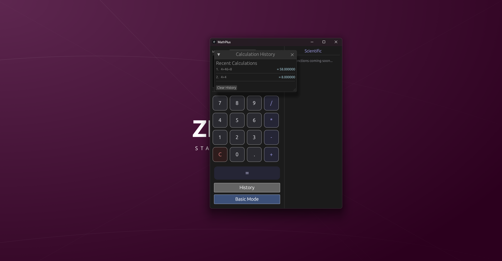

<!-- ========================================================= -->
<!-- Standards Approval Badge -->
<!-- ========================================================= -->

<table align="right">
  <tr>
    <td>
      
    </td>
  </tr>
</table>

<!-- ========================================================= -->

<!-- Required Badges -->

<!-- ========================================================= -->

[](https://docs.zford.dev)


<!-- ========================================================= -->

<!-- Optional Badges -->

<!-- ========================================================= -->

[](https://zforddev.itch.io/mathplus)


# MathPlus

> A tiny, fast, distraction‑free calculator built in Rust using `egui`.  
> **Status:** Stable • Actively Maintained • Accepting Contributions

---

## Why This Exists

Most desktop calculators are either:

- bloated  
- slow to open  
- packed with features you don’t need  
- or tied to a larger OS ecosystem  

MathPlus was built to be the opposite:

- **fast**  
- **local‑first**  
- **lightweight**  
- **no telemetry**  
- **no background processes**  

It opens instantly, stays out of the way, and does its job — nothing more.

MathPlus is also a great **learning reference** for Rust developers exploring GUI apps with `egui` and `eframe`.

---

## Overview

MathPlus is a simple, clean calculator with:

- instant startup  
- a minimal UI  
- keyboard‑friendly input  
- a small, readable Rust codebase  
- a pure local workflow

It’s intentionally basic — ideal for quick math, teaching, experimenting, or extending into your own ideas.

---

## Features

- Fast startup and low resource usage  
- Standard math operations  
- Clean, minimal interface  
- Keyboard‑first workflow  
- Copy‑to‑clipboard support  
- Rust + `egui` codebase that’s easy to explore  

---

## Requirements

MathPlus is a native Rust application.

**Operating System**
- Windows 10 or later  
- Linux support planned (AppImage / .deb)

**Hardware**
- CPU: 1 core  
- RAM: ~50–80 MB  
- Disk: ~5–10 MB  

**Rust Toolchain (for building from source)**
- Rust 1.80+  
- Cargo (included with Rust)

---

## Quick Start

Build MathPlus from source:

```bash
git clone https://github.com/ZFordDev/MathPlus.git
cd MathPlus

cargo build --release
```

The compiled binary will be located at:

```
target/release/MathPlus
```

---

## Installation

Most users should download the prebuilt Windows installer:

👉 [https://github.com/ZFordDev/MathPlus/releases](https://github.com/ZFordDev/MathPlus/releases/latest/")

**Windows Installer Includes**
- Start Menu shortcut  
- Optional desktop shortcut  
- Clean uninstall  
- Installs to:  
  ```
  C:\Program Files (x86)\StaxDash\MathPlus
  ```

A portable `.exe` is also available.

Linux builds are planned for a future release.

---

## Usage

MathPlus is keyboard‑friendly:

- `0–9`, `.`, `+`, `-`, `*`, `/` — enter expression  
- `Enter` or `=` — evaluate  
- `Backspace` — delete last character  
- `Esc` — clear input  
- `Ctrl + C` — copy result  

Just open it and type.

---

## Project Structure

```text
MathPlus/
├── src/
│   ├── main.rs          # App entry point
│   ├── ui.rs            # UI layout + egui widgets
│   ├── state.rs         # Calculator state + logic
│   └── updater.rs       # Optional update checker
│
├── assets/              # Icons and branding
├── Cargo.toml           # Package metadata + dependencies
├── LICENSE
└── README.md
```

---

## Roadmap

- [ ] Linux packaging  
- [ ] Calculation history  
- [ ] Scientific mode  
- [ ] Themes  
- [ ] More keyboard shortcuts  
- [ ] Better expression parser  

---

## Screenshots

<p align="center">
  
  
</p>

---

## Known Issues

- Linux builds not yet available  
- No scientific functions (yet)  
- No persistent history  

---

## Related Projects

- **SchedPlus** - a basic Desktop Scheduler
  https://github.com/ZFordDev/SchedPlus 

---

## Support

You can support MathPlus by:

* Leave a ⭐ on GitHub
* Report bugs
* Suggest new features
* Improve documentation
* Contribute code

---

## Contributing

Contributions, bug reports, feature requests, and feedback are welcome.

See `CONTRIBUTING.md` for project‑specific guidelines.  
For ecosystem‑wide expectations, see [STANDARDS.md](https://github.com/ZFordDev/ZFordDev/blob/main/STANDARDS.md).

---

## Security

See `SECURITY.md` for vulnerability reporting guidelines.  
If no security policy is present, please report issues responsibly via GitHub Issues.

---

## License

Released under the MIT License.  
See `LICENSE` for details.

---

## About ZFordDev

This project is part of the ZFordDev ecosystem — a collection of lightweight, practical tools built with clarity, simplicity, and long‑term maintainability in mind.

For ecosystem‑wide standards, see [STANDARDS.md](https://github.com/ZFordDev/ZFordDev/blob/main/STANDARDS.md).

---